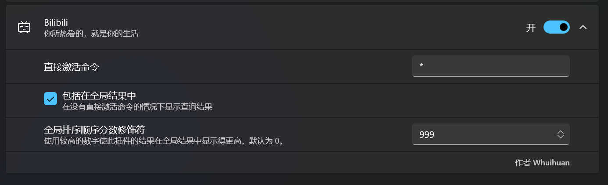

# PowerToys Run: 哔哩哔哩解析插件

参考 [PowerToys Run](https://learn.microsoft.com/windows/powertoys/run) 的插件管理器中搜索Bilibili.

## 要求

- PowerToys 最低版本 0.81.0

## Installation

- 到 [latest release](https://github.com/Whuihuan/PowerToysRun-Bilibili/releases/) 里选择适合你的平台的插件： `x64` (绝大多数) 或 `ARM64`
- 关闭PowerToys
- 解压文件到 `%LOCALAPPDATA%\Microsoft\PowerToys\PowerToys Run\Plugins`
- 打开PowerToys

## 感谢

- 本项目移植自Wox插件 [Bilibili](http://www.wox.one/plugin/424)，感谢 [shirokurakana](https://github.com/shirokurakana)。

## 截图

